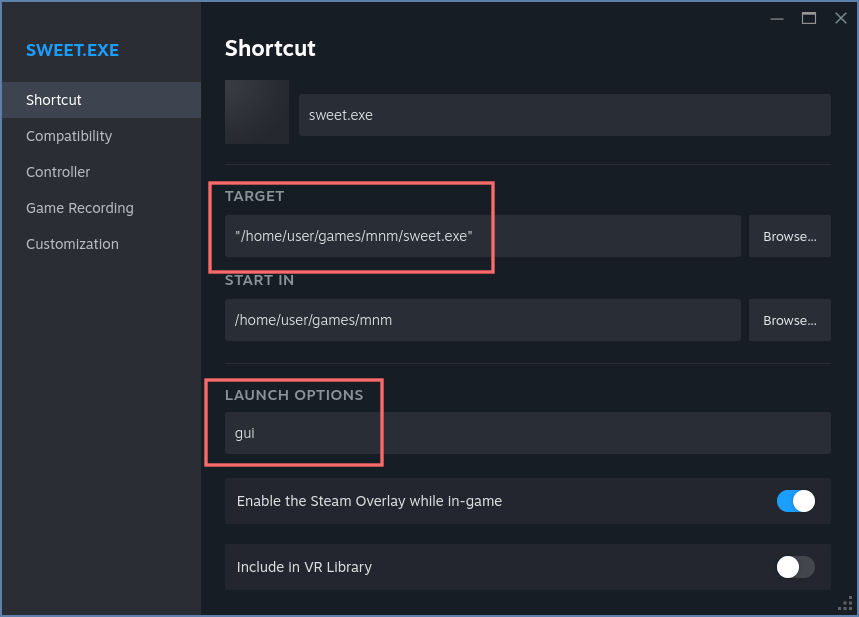
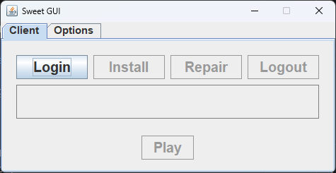

= Sweet MnM Launcher
ifdef::env-github[]
:!toc-title:
:tip-caption: :bulb:
:note-caption: :paperclip:
:important-caption: :heavy_exclamation_mark:
:caution-caption: :fire:
:warning-caption: :warning:
endif::[]

Alternative Launcher for https://monstersandmemories.com/[Monsters and Memories] game.

== Motivation

The current https://account.monstersandmemories.com/launcher[official launcher] does not play nice with Linux.
Even though it's a native Linux app, there are several issues that require tinkering, specially for SteamDeck users.

That's why we created an alternative launcher that should provide an easy end-to-end experience:

* Single self-contained package with all required files: `Download > Extract > Run`.
* Windows build compatible with Proton (e.g Steam, UMU, PROTON-GE + Lutris).
Setup and run the client directly from Sweet Launcher, no need for tinkering.
* Linux build with dedicated Linux features.
Not recommended for Steam users since it has the same limitations of the Official Launcher.
Requires MangoHud and https://github.com/Open-Wine-Components/umu-launcher[UMU] installed.
* Better session management.
You can see when your token will expire, and you'll get a message when the time comes to log in again.

Note however, it won't work on other WINE distributions.

== Getting Started (Recommended method)

. Download the Windows build from the https://github.com/yagrim/sweet-mnm/releases[latest release] (under `Assets`).
. Extract all files where you want to install the game client.
. Setup "sweet.exe" in you preferred Proton environment with the "gui" option. For example in Steam:
+

. Start it! First time you'll need to "Login", then "Install".
+
To save time and bandwidth, you can copy the "mnm" folder from your current installation, "Install" will check the files and patch only the changes.
+

== Future work

* Improve usability: download speed metrics, pause download, etc.
* Multiple clients management.
* More Linux specific features:
** more MANGOHUD,
** customize https://github.com/Open-Wine-Components/umu-launcher[UMU] configurations
** https://github.com/OneCrazyCoder/MMOGamepadOverlay[MMOGamepadOverlay] integration, etc.

== Advanced features

The app is in fact a cli tool.
Run `sweet --help` to find the extra features.

== Development

The project is a Java project that uses:

* Gradle as a build tool.
* GraalVM CE 25 to compile to a binary (and required libraries).

NOTE: GraalVM does not support cross compilation, to build the Windows binary you'll need an actual environment.
It can be physical or a virtual machine.

== Troubleshooting

. Launcher gets stuck during "Install" or "Repair".
+
Process may take more or less time depending on your internet connection and drive, but it should not get stuck.
If you want to get more information, enable debug under "Options" and check the log console.
+
Also, it's safe to kill the launcher, the next time you run Install/Repair will continue where it stopped.

. The Launcher was working fine, and now it does not start.
+
On very rare occasions, the configuration database gets corrupted.
If all safeguards fail, delete the db and login again:

* For Windows build:

    {WINE_PREFIX}/drive_c/users/steamuser/AppData/Local/com.monstersandmemories.sweet/sweet-config.db

* For Linux build:

    ${HOME}/.local/share/com.monstersandmemories.sweet

== Contributing

If you want to lend a hand;

* The code is full of `TODO` that need fixing.
* Check GH Issues tab to see if something is of your interest.
* There are no special policies about tools/AI. However, time to review is proportional to the amount of code, general quality and reasoning.
